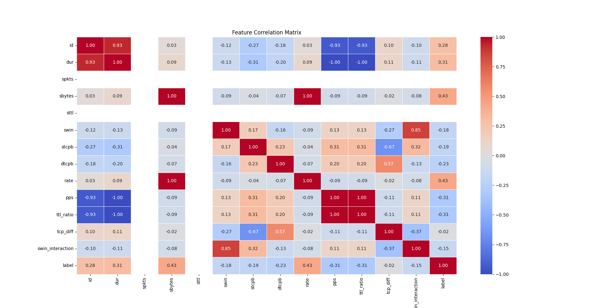
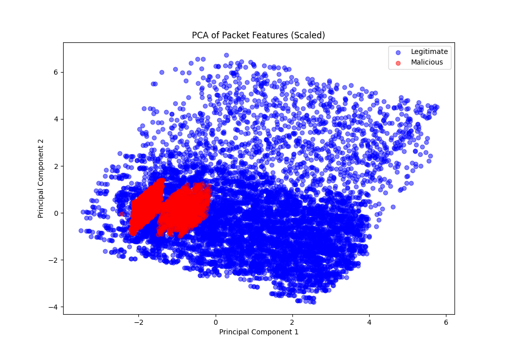
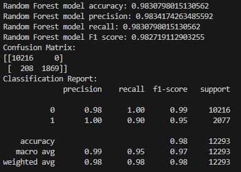

# Model Training

This folder of the project includes scripts for training a Random Forest classifier to predict network traffic patterns. The guide below explains how to set up and use a virtual environment to run `train_random_forest.py`. In order to use the script, you need to create the CSV files that contain the training and testing sets. To do so, place the pcap files that you created in `../data/captures`. Then follow the steps below:

## Why Random Forest?

We chose a Random Forest classifier because it is an ensemble learning method that combines multiple decision trees to improve classification accuracy and reduce overfitting. Random Forest is robust to noise, works well with imbalanced datasets, and is efficient for network traffic classification. However, given that network traffic is inherently sequential, we are also exploring deep learning models, such as Recurrent Neural Networks (RNNs), for future iterations.

## Dataset

The training process follows the structure of the UNSW-NB15 dataset, a benchmark dataset used for network intrusion detection. This dataset provides a mix of normal and malicious traffic, making it suitable for training a classifier to distinguish between benign and attack patterns.

## Labeling Process

The parameters used for training were:

- id: Unique identifier for each packet, used to track individual packet instances in the dataset.
- dur: Duration of the flow to which the packet belongs, providing temporal context for network activity.
- spkts: Number of packets sent by the source, used to analyze traffic volume and potential anomalies.
- sttl: Source Time-to-Live (TTL), which helps detect suspiciously short-lived connections.
- swin: Source window size, providing insights into TCP congestion control and potential malicious behavior.
- vstcpb: Initial sequence number of the source TCP segment, used to track TCP session characteristics.
- dtcpb: Initial sequence number of the destination TCP segment, helping detect irregularities in session establishment.
- pps: Packets per second, a critical feature for identifying high-rate traffic anomalies.
- ttl_ratio: Ratio between source and destination TTL, used to detect TTL manipulation in attacks.
- tcp_diff: Difference between TCP sequence numbers, indicating variations in packet sequencing.
- swin_interaction: Interaction level of source window size, helping understand adaptive flow behavior.

Additionally, we successfully generated malicious packets that closely resembled normal traffic, ensuring better training and improved model performance.

## Feature Correlation Matrix

A feature correlation matrix reveals the relationships between different features in the dataset, helping to identify those most associated with the target label. In our dataset, the features id, dur, sbytes, rate, pps, and ttl_ratio show the highest correlation with the label. However, none of them exhibit a particularly strong correlation, indicating that no single feature dominates in determining the label.



## PCA of the Dataset

Principal Component Analysis (PCA) is a dimensionality reduction technique that transforms the dataset into a set of orthogonal components, allowing us to visualize its variance. In our dataset, the malicious packets are mixed with the normal ones, indicating that PCA does not provide a clear separation between the two classes.



## Performance of our ML Model

The Random Forest model was trained on data from Network 1 and tested on data from Network 2, yielding the following performance metrics:



These results indicate that the model performs very well, with high accuracy and balanced precision-recall values. However, the presence of overfitting is a concern, as the dataset is not particularly large. This suggests that the model may not generalize well to unseen network traffic and could benefit from additional data or regularization techniques.


## How to Train the Random Forest

### 1. Create a Virtual Environment

First, create a virtual environment in your project directory. Open a terminal and navigate to your project directory, then run:

```sh
python -m venv venv
```

### 2. Activate the Virtual Environment

- **Windows**: 
  ```sh
  .\venv\Scripts\activate
  ```
- **MacOS**: 
  ```sh
  source venv/bin/activate
  ```

### 3. Install Required Libraries

```sh
pip install -r requirements.txt
```

### 4. Run `process_pcap.py`

```sh
python tools/process_pcap.py
```

Now you will find the dataset in `../data/csv_files`. Use this file to train the random forest model.

### 5. Run `train_random_forest.py`

```sh
python train_random_forest.py
```

## How to Check the Performance of Your Model

In the `tools` folder, you can find `test_model.py` to check if the model you created is functioning. Firstly, you need to change:

```sh
csv_file = "file_of_the_data" 
model_file = "file_of_the_model"
```

For more information on the dataset, please refer to the original research paper: UNSW-NB15: A Comprehensive Data Set for Network Intrusion Detection Systems (NIDS) Research.

in your script with the actual directories of your files.